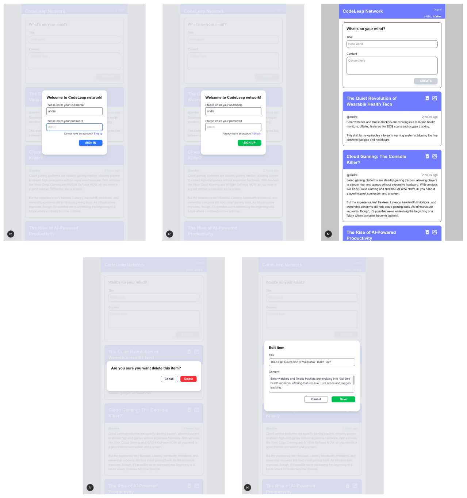

# Codeleap Challenge

This project refers to a challenge completed as part of an assessment for a developer position application at Codeleap.



## Requirements

The challenge requirements are available [here](https://www.figma.com/design/0OQWLQmU14SF2cDhHPJ2sx/CodeLeap-Engineering-Test?node-id=0-1&p=f&t=IjvOFJEULwMq1RT7-0).

## Live demo
Check out the live assessment [here](http://69.62.89.87:9999/)

## Run local

### Secrets

It's known that secrets should be store in an .env file, but for the sake of simplicity, the environmnet variables were set in the docker compose file, so you don't need worry about it. 

Considering that the web app and API images are hosted on Docker Hub, and you have docker installed, just download the docker-compose-prod.yml file and run:

```docker compose up --build```


## Stack

It's powered by


